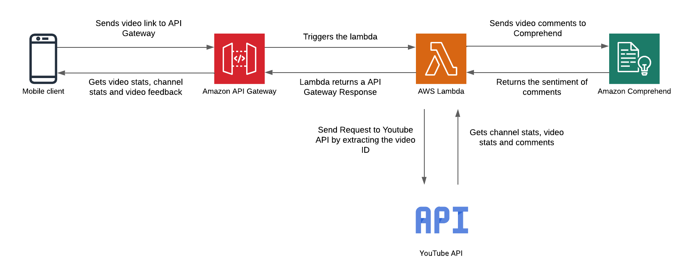

# Youtube-Analytics-Mini---Android

## Overview
The YouTube Analytics Mini is an Android application that provides users with the overall feedback of the YouTube video/ One can check via the video link to see the likes views, channel details, and sentiment of the YouTube video comments by the audience. The application uses AWS Lambda for the backend whereas the Android app is the end user's front end.

This Android application acts as a user interface for the end user.

## Lambda Code-
The code of the Lambda can be viewed here- https://github.com/Antriksh1234/Youtube-Analytics-Mini---Lambda

## Project Architecture-

## Tools and tech used-
1. Java
2. XML
3. Android
4. Go
5. AWS Lambda
6. AWS Comprehend
7. AWS API Gateway
8. Youtube API
9. Adobe Illustrator for creating vectors
